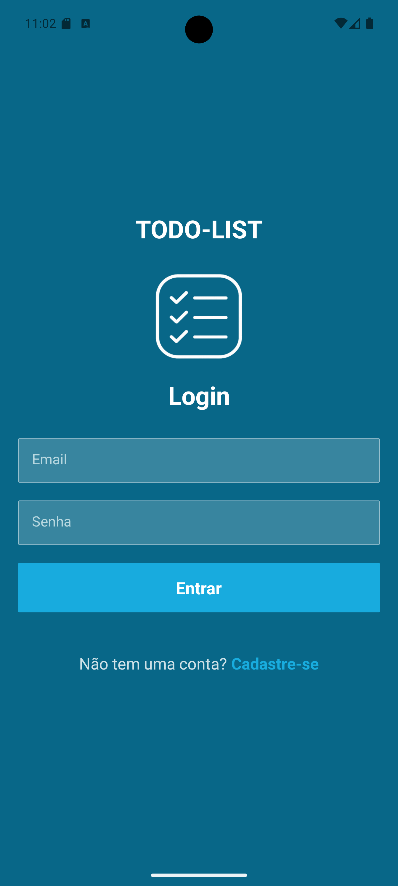
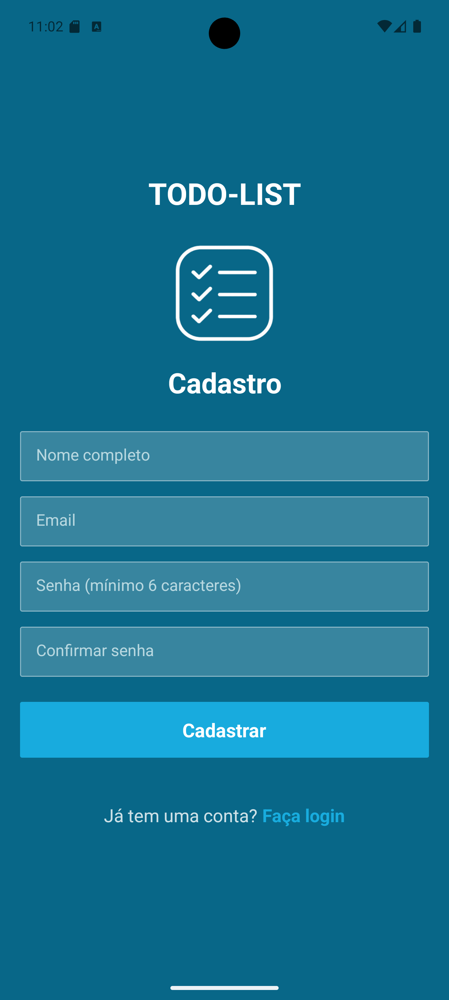

# 📝 TodoList Mobile


[](https://reactnative.dev/)

## 🎯 Objetivo

Aplicativo **Todo-List Mobile** desenvolvido com **React Native**, voltado para organização de tarefas diárias. Com uma interface limpa e intuitiva, o app permite cadastrar, visualizar e gerenciar tarefas em tempo real.

---

## 📱 Funcionalidades

- ✅ Criação de novas tarefas com título.
- 📋 Listagem das tarefas cadastradas.
- 🗑️ Remoção de tarefas concluídas.
- 📈 Contador de tarefas criadas e tarefas concluídas.
- 📵 Validação para evitar criação de tarefas com nome em branco.

---

## 🛠️ Tecnologias e Ferramentas Utilizadas

<p align="center">
  
  
  
</p>

---

## ▶️ Instalação e Execução

### 🔧 Pré-requisitos

Antes de iniciar, certifique-se de ter instalado:

- [Node.js](https://nodejs.org/)
- [Expo CLI](https://docs.expo.dev/get-started/installation/)
- Emulador Android ou aplicativo **Expo Go** no seu celular.

### 🚀 Passo a passo

```bash
# Clone o repositório
git clone https://github.com/LeandroBarbosa753/todolist-mobile.git

# Acesse a pasta do projeto
cd todolist-mobile

# Instale as dependências
npm install
# ou
yarn install

# Inicie o servidor de desenvolvimento
npx expo start
```

Depois disso, você poderá escanear o QR code com o aplicativo **Expo Go** ou rodar no emulador Android/iOS.

---

## 📂 Estrutura do Projeto

```bash
.
├── assets/             # Ícones e imagens
├── components/         # Componentes reutilizáveis (Input, Task, etc.)
├── App.tsx             # Arquivo principal da aplicação
├── app.json            # Configurações do projeto Expo
├── package.json        # Dependências do projeto
```

---

## 📸 Capturas de Tela

Abaixo estão algumas capturas que demonstram a funcionalidade e a interface do sistema de gerenciamento de tarefas:

### 🔐 Tela de Login

Tela de autenticação do usuário para acesso ao sistema.  


---

### 📝 Cadastro de Novo Usuário

Formulário para criação de uma nova conta de usuário.  


---

### 🧭 Tela Principal

Interface principal do sistema, onde é possível visualizar as tarefas ativas e concluídas.  


---

### ➕ Adicionando uma Nova Tarefa

Formulário para adicionar uma nova tarefa à lista.  


---

### ✅ Tarefa Adicionada com Sucesso

Exibição da tarefa recém-adicionada na lista principal.  


---

### ✔️ Tarefa Marcada como Concluída

Tarefa marcada como concluída, destacando a funcionalidade de controle de status.  


---

## 📌 Melhorias Futuras

- Integração com backend para persistência dos dados.
- Autenticação de usuários.
- Filtragem de tarefas por status (concluídas / pendentes).
- Dark mode 🌙.

---

## 👨‍💻 Desenvolvedores

|  |  |
| :-----------------------------------------------------------------------: | :-----------------------------------------------------------------------: |
|          [Leandro Barbosa](https://github.com/LeandroBarbosa753)          |             [Kalline Ferreira](https://github.com/KaahSilva)              |
